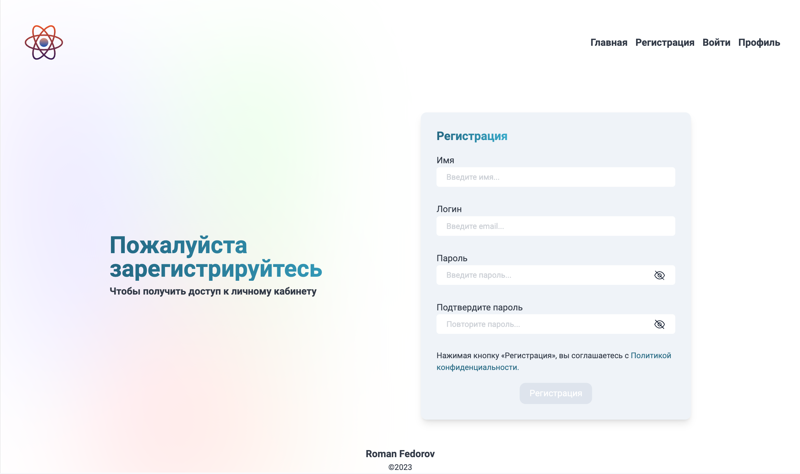

<h1 align='center'> Sum1 Auth</h1>


Deploy [Vercel](https://sum1-test.vercel.app/)




## Запуск проекта 
1) Установить зависимости

```bash
npm install
```
2) Запустить проект в режиме разработки на [http://localhost:3000](http://localhost:3000) | Сервер запустится на [http://localhost:3001](http://localhost:3001)
```bash
npm run dev
# or
yarn dev
```

Пароль для всех тестовых пользователей: ```123456```

## Технические требования:
Реализовать приложение (SPA), которое умеет показывать следующие страницы:
- / — главная
- /login — страница ввода логина и пароля
- /registration — форма из нескольких полей, недоступна авторизованным пользователям
- /profile — страница с приветствием + имя пользователя + кнопка выхода (logout), недоступная без авторизации
- Если пароли не совпадают отображать ошибку: «Введенные пароли не совпадают»
- Если логин уже присутствует в JSON файле выдавать ошибку: «Пользователь с таким логином уже зарегистрирован»
- Если валидация формы прошла успешно — отобразить сообщение об успешной регистрации + кнопка перехода к форме логина (/login)
- Если данные не совпадают ни с одним из пользователей, то показывается сообщения:«Имя пользователя или пароль введены не верно»
- Если введены корректные данные, то перебрасывать на страницу /profile
- При обновлении страницы в браузере пользователя авторизованного пользователя не должно разлогинивать.


